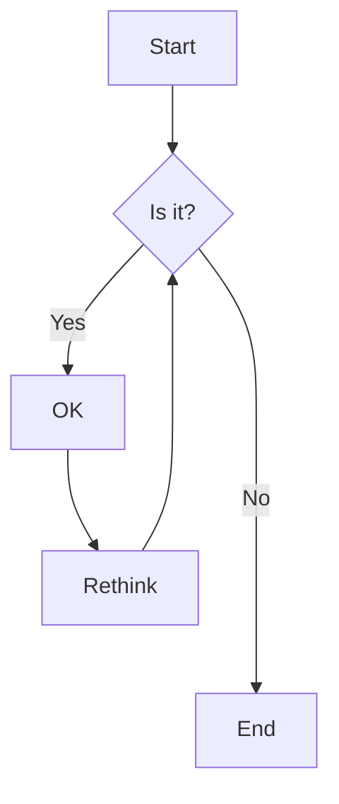

# GitHub

[GitHub](https://github.com/) is a web-based platform for hosting files in repositories, collaborating on projects, and tracking changes to files over time. It uses Git, an open-source version control system, to manage and track changes. We use GitHub to organize the materials, user access, conversations, and issue tracking for all the content and people associated with our relevant courses and programs. This resource contains all of the information on our GitHub configuration.

### Organizations

[Organizations](https://docs.github.com/en/organizations/collaborating-with-groups-in-organizations/about-organizations) are shared accounts where we can collaborate across many projects at once. Our organizations are:

- [ccsf-math](https://github.com/orgs/ccsf-math-108): For all non-course-specific projects under the Mathematics Department
- [ccsf-math-108](https://github.com/orgs/ccsf-math-108): For all of the MATH 108 materials and staff

## Users

### Repositories

[Repositories](https://docs.github.com/en/repositories/creating-and-managing-repositories/about-repositories) contain all of the code, files, and each file's revision history. We can discuss and manage our work within the repository. There are several repositories within our organizations, here are the main repositories:

- [ccsf-math/jupyterhub](https://github.com/ccsf-math/jupyterhub/): The public repository containing the configuration files for the CCSF JupyterHub
- [ccsf-math-108/materials](https://github.com/ccsf-math-108/materials): The private repository for all the MATH 108 materials
- [ccsf-math-108/materials-fa25-staff](https://github.com/ccsf-math-108/materials-fa25-staff): The private repository for sharing all of the available MATH 108 materials and conversations with relevant individuals for Fall 2025
- [ccsf-math-108/materials-fa25](https://github.com/ccsf-math-108/materials-fa25): The public repository for sharing all of the available MATH 108 materials and conversations for Fall 2025

The content within the materials-fa25-staff and materials-fa25 repositories are derived from the materials repository.

### Projects

We use [GitHub Projects](https://docs.github.com/en/issues/planning-and-tracking-with-projects) to organize the release and development of course materials each semester and to host conversations about updates, clarifications, and issues.

#### Project Setup
1. Create a [new project](https://github.com/orgs/ccsf-math-108/projects) using the naming scheme "`SEMESTER` `YEAR` Materials" (e.g., "Fall 2025 Materials").
