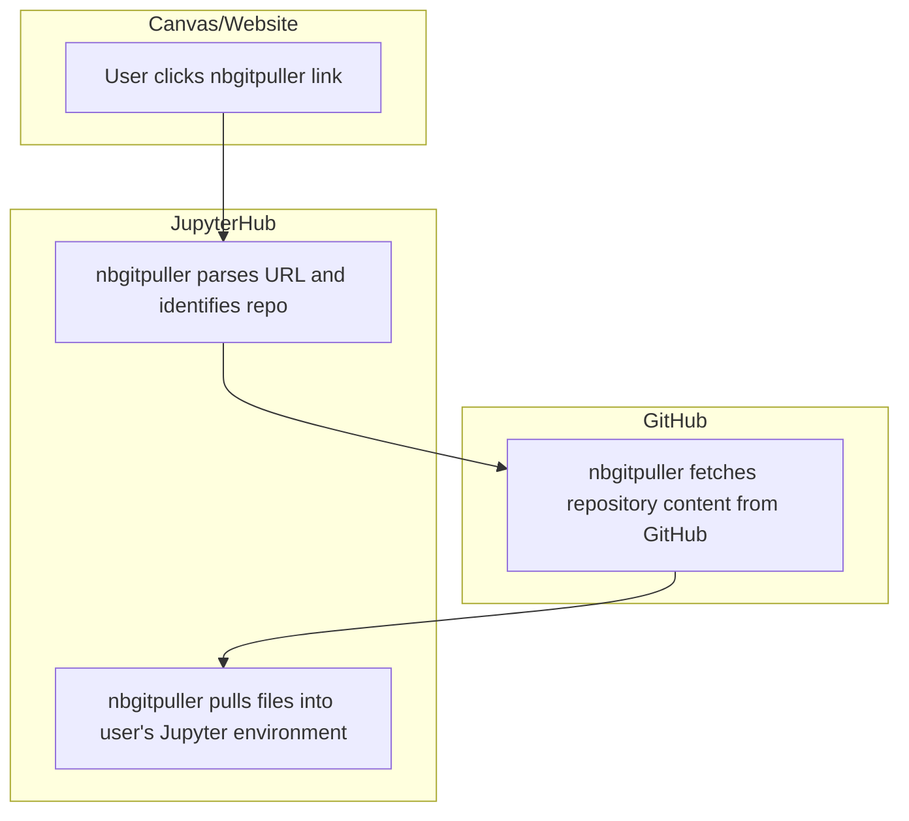

# Infrastructure

## Responsibility
The Data Science coordinator maintains the technology needed to run MATH 108.

## Overview
We utilize various technologies to provide students, faculty, and staff with interactive notebooks for lectures and assignments. A [JupyterHub](https://jupyter.org/hub), grant-supported by [Cloudbank](https://www.cloudbank.org/) and [2i2c](https://2i2c.org/), is the central piece of our technology that is used for authenticating users, synchronizing course materials, 


The Data Science coordinator should work with {term}`Sean Morris` and {term}`Shawn Wiggins` to make sure the JupyterHub is set up before the start of the semester and continue to be in communication with them about updates and issues.

## MATH 108 Technology

### Authentication 
Cloudbank hubs are configured to use [CILogon](https://www.cilogon.org/) to manage user access. By default, users authenticate with their Google accounts. At CCSF, our `mail.ccsf.edu` domain is associated with Google, so any user logging in with a `mail.ccsf.edu` account will be automatically approved.

If a user logs in with a different Google-associated domain (e.g., `gmail.com`, `berkeley.edu`), their account must be manually added to an approved list. To request access, the user should send their Google account email address to {term}`Sean Morris`. Once the account is approved, the user will be able to log in with that Google account.

> 🔐 **Quick summary**:  
> If you're using a `mail.ccsf.edu` Google account, you're already approved.  
> If you're using another Google account (e.g., `gmail.com`), email your address to {term}`Sean Morris` to request access.

```mermaid
flowchart TD;
    A[User accesses JupyterHub] --> B[Redirect to CILogon]
    B --> C[User selects Google as Identity Provider]
    C --> D[Redirect to Google Login]
    D --> E[User logs in with Google]
    E --> F[Google returns OAuth token to CILogon]
    F --> G[CILogon returns assertion to JupyterHub]
    G --> H[JupyterHub authenticates user]
    H --> I[Spawn user server]
    I --> J[User lands on JupyterHub interface]
    J --> K[User interacts with JupyterHub]

    subgraph Google Services
        E
        F
    end

    subgraph CILogon
        C
        D
        G
    end

    subgraph JupyterHub
        B
        H
```

### `nbgitpuller` Link Flow

