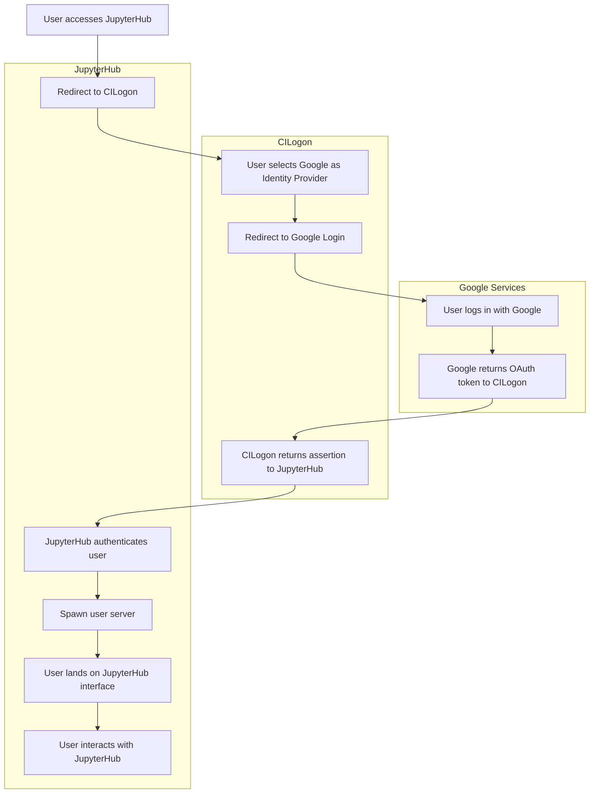
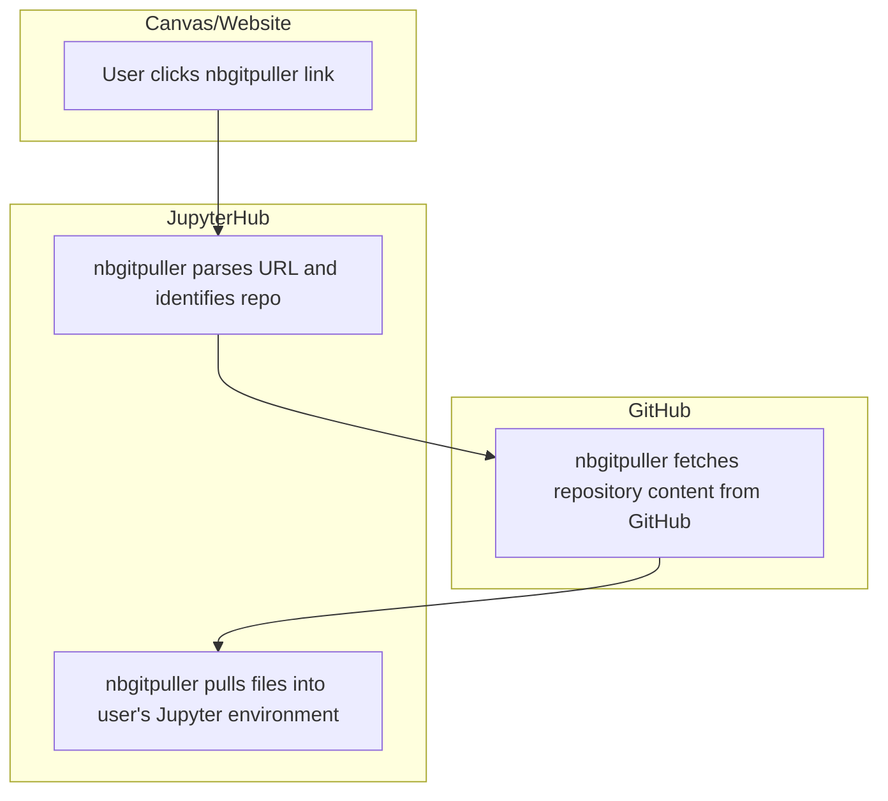

# Infrastructure

## Responsibility
The Data Science coordinator maintains the technology needed to run MATH 108.

## Overview
We utilize various technologies to provide students, faculty, and staff with interactive notebooks for lectures and assignments. A [JupyterHub](https://jupyter.org/hub), hosted by [Cloudbank](https://www.cloudbank.org/) and [2i2c](https://2i2c.org/), is the central piece of our technology that is used for authenticating users, synchronizing course materials, 

The Data Science coordinator should work with {term}`Sean Morris` and {term}`Shawn Wiggins` to make sure the JupyterHub is set up before the start of the semester and continue to be in communication with them about updates and issues.

## MATH 108 Technology

### Authentication Flow

### `nbgitpuller` Link Flow

