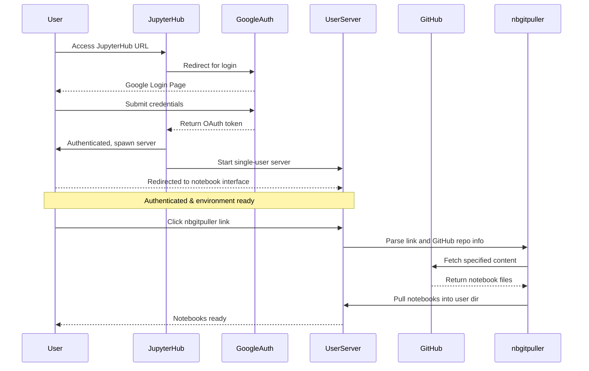
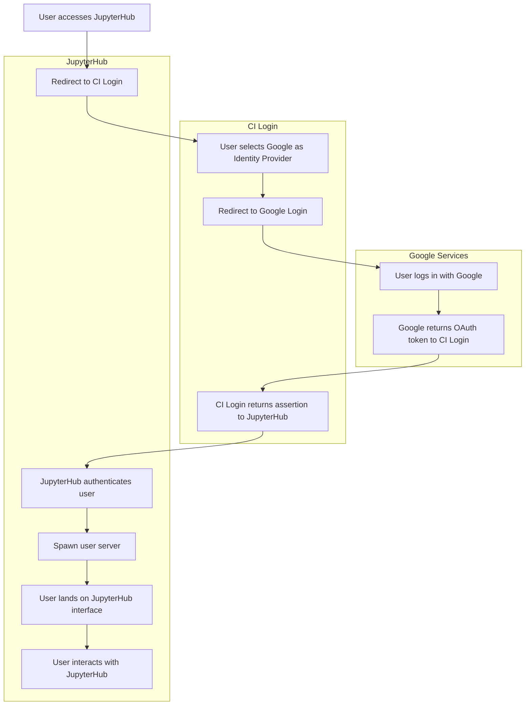
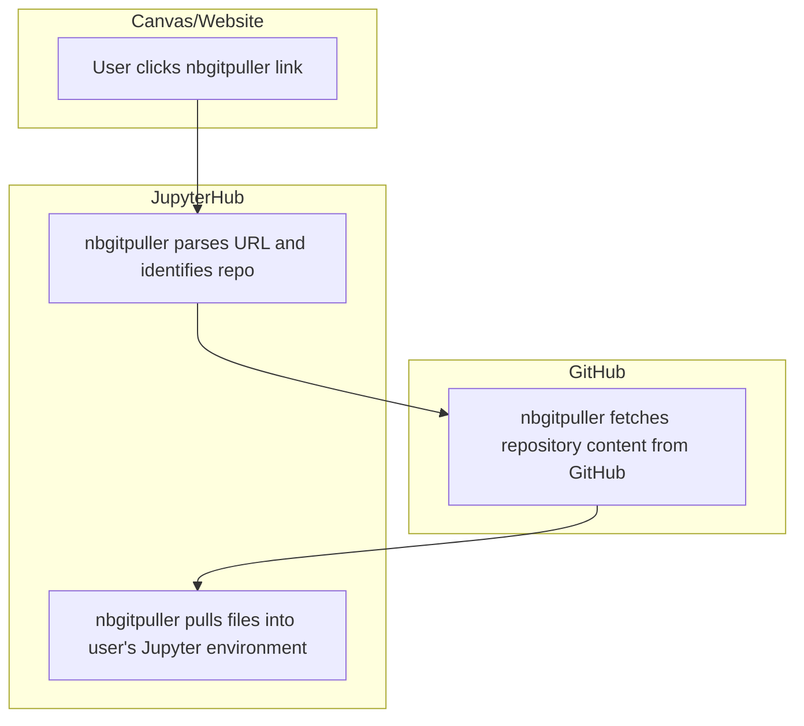

# Infrastructure

## Responsibility
The Data Science coordinator maintains the technology needed to run MATH 108.

## Overview
MATH 108 utilizes various applications from the [Project Jupyter](https://www.jupyter.org) community to provide students with interactive notebooks for lectures and assignments. The Data Science coordinator should work with {term}`Sean Morris` and {term}`Shawn Wiggins` to make sure the JupyterHub is set up before the start of the semester and continue to be in communication with them about updates and issues.

## MATH 108 Technology

### Authentication Flow

### `nbgitpuller` Link Flow

