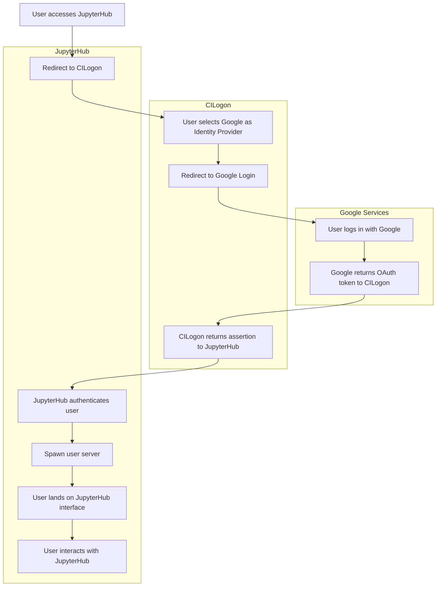
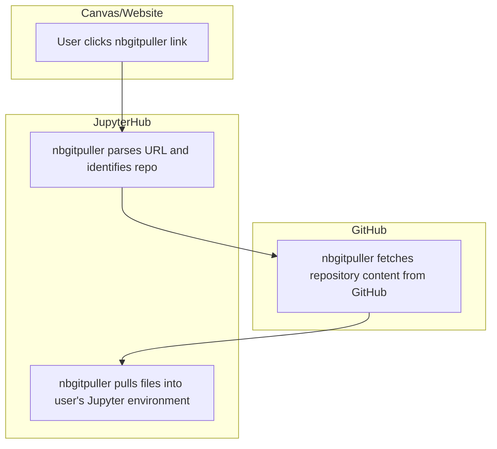

# JupyterHub

A [JupyterHub](https://jupyter.org/hub), grant-supported by [Cloudbank](https://www.cloudbank.org/) and [2i2c](https://2i2c.org/), is the central piece of our technology. The hub's address is `https://ccsf.cloudbank.2i2c.cloud`.

When a user clicks an `nbgitpuller` link (e.g., from Canvas or a website), the system checks whether the user is authenticated with JupyterHub. If not, the user is redirected through the authentication flow (e.g., via CILogon + Google). Once authenticated, the `nbgitpuller` link pulls content from a GitHub repository into the user’s environment and optionally opens a specific notebook or file.

### Authentication 
Cloudbank hubs are configured to use [CILogon](https://www.cilogon.org/) to manage user access. By default, users authenticate with their Google accounts. At CCSF, our `mail.ccsf.edu` domain is associated with Google, so any user logging in with a `mail.ccsf.edu` account will be automatically approved.

If a user logs in with a different Google-associated domain (e.g., `gmail.com`, `berkeley.edu`), their account must be manually added to an approved list. To request access, the user should send their Google account email address to {term}`Sean Morris`. Once the account is approved, the user will be able to log in with that Google account.

### `nbgitpuller`
In order to synchronize the content hosted on GitHub with the content on a user's JupyterHub storage while automatically handling the conflicts involved `git`, we use the application [`nbgitpuller`](https://nbgitpuller.readthedocs.io/). Through `nbgitpuller`, we create links which our users click to pull in content available on a specified GitHub repository with the user's files on the specified JupyterHub server. When there is a merge conflict, the tool handles the merge automatically according to the rules posted in the [`nbgitpuller` documentation](https://nbgitpuller.readthedocs.io/en/latest/topic/automatic-merging.html).

