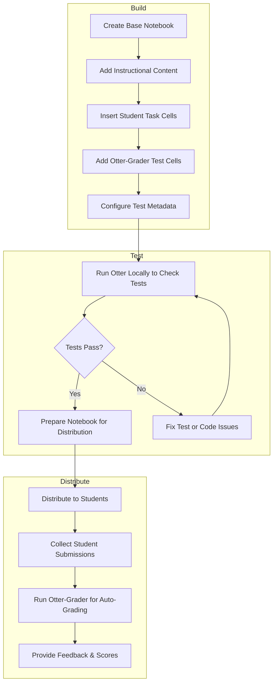

[otter-grader](https://otter-grader.readthedocs.io/) is an open-source auto-grader developed the Data Science Education Program at UC Berkeley. We use this with our Jupyter Notebooks to provide auto-grader feedback for students and to assist instructors with assignment grading.

---

## Notebook Development and Distribution
Notebooks intended for use with Otter-Grader are created by embedding special test cells within the Jupyter Notebook that contain hidden or visible tests, which Otter-Grader uses to automatically check students’ work. These test cells include assertions and test code formatted according to [Otter’s specifications](https://otter-grader.readthedocs.io/en/latest/otter_assign/notebook_format.html), allowing instructors to define precise grading criteria directly inside the notebook. When students submit their notebooks, Otter-Grader runs these tests to provide immediate, automated feedback and scores, streamlining the grading process for instructors.

